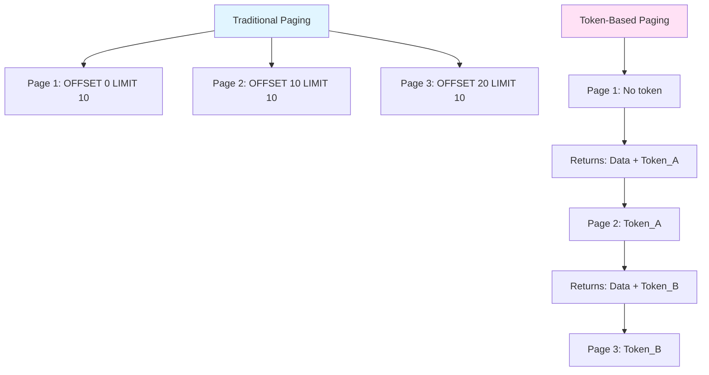
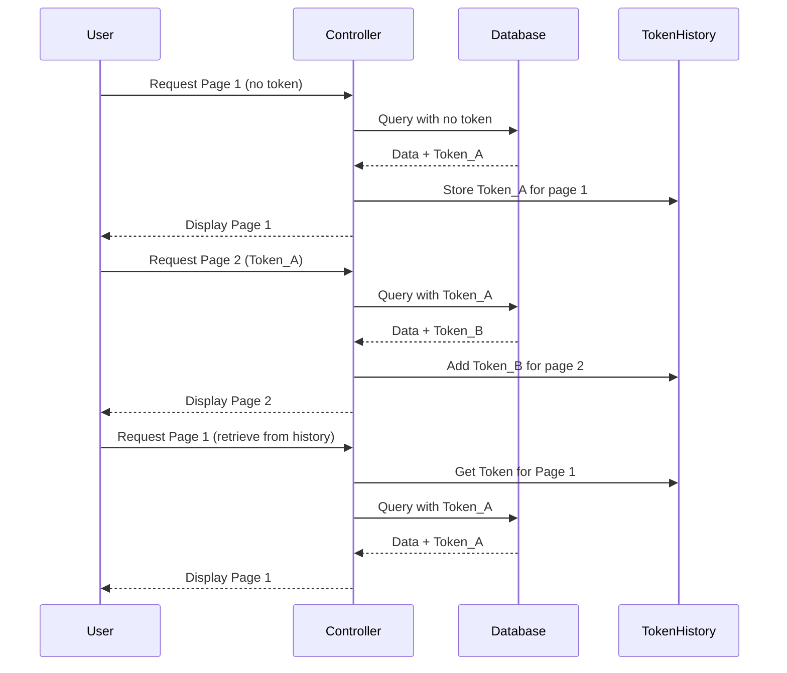
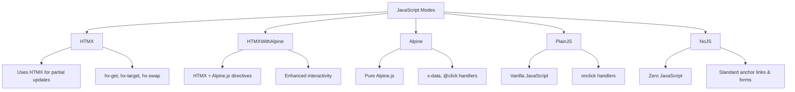

# PagingTagHelper v1.0.0: Enterprise-Ready Pagination for Modern ASP.NET Core

<datetime class="hidden">2025-11-07T19:12</datetime>
<!--category-- Nuget, ASP.NET Core, HTMX, Alpine.js, Javascript, TagHelper, PagingTagHelper -->

> NOTE: COMING SOON, just putting the finishing touches to it. [Follow along on GitHub! ](https://github.com/scottgal/mostlylucid.pagingtaghelper).

**This is just to show you all I AM making progress with this control! It'll be worth the wait.**

## Introduction

After months of evolution and valuable feedback from the community (5.7k+ downloads!), I'm excited to announce that the PagingTagHelper library has reached version 1.0.0. This isn't just a version number bump – it represents a complete maturation of the library with features that make it suitable for real-world, production applications.

If you've been following this series, you'll remember we started with [bare-bones paging](https://www.mostlylucid.net/blog/pagingtaghelper), added [sortable headers](https://www.mostlylucid.net/blog/pagingtaghelperpt11), and extracted [page size controls](https://www.mostlylucid.net/blog/pagingtaghelperpt2). Version 1.0.0 takes everything we've learned and adds critical enterprise features:

- **Continuation Token Pagination** for NoSQL databases (Cosmos DB, DynamoDB, Azure Table Storage)
- **Multi-language Localization** supporting 8 languages out of the box
- **Flexible JavaScript Modes** from HTMX to zero-JavaScript
- **Pure Tailwind Views** without DaisyUI dependencies
- **Smart URL Parameter Preservation** across all navigation
- **HTMX 2.0.4** upgrade with backward compatibility

Let's dive into each of these features and see how they work together to create a truly flexible pagination solution.

[](https://www.nuget.org/packages/mostlylucid.pagingtaghelper)
[](https://www.nuget.org/packages/mostlylucid.pagingtaghelper)

[TOC]

## Continuation Token Pagination {#continuation-token-pagination}

Traditional pagination works beautifully with SQL databases where you can easily `SKIP` and `TAKE` records. But what happens when you're working with NoSQL databases like Cosmos DB, DynamoDB, or Azure Table Storage? These databases don't support offset-based pagination – instead, they use **continuation tokens**.

### Understanding Token-Based Pagination {#understanding-token-based-pagination}

Here's how continuation token pagination differs from traditional paging:



**Traditional Paging:**
- You specify exactly which records to retrieve (OFFSET/LIMIT)
- You can jump to any page directly
- Database must scan through all previous records

**Token-Based Paging:**
- Database returns an opaque token representing "where to continue"
- Token format is database-specific and opaque to the client
- Forward navigation is natural, backward navigation requires token history

### Continuation Pager Implementation {#continuation-pager-implementation}

The new `<continuation-pager>` tag helper makes implementing token-based pagination straightforward. First, create a model that implements `IContinuationPagingModel`:

```csharp
public class ProductPagingViewModel : IContinuationPagingModel
{
    public string? NextPageToken { get; set; }
    public bool HasMoreResults { get; set; }
    public int PageSize { get; set; } = 25;
    public int CurrentPage { get; set; } = 1;
    public Dictionary<int, string>? PageTokenHistory { get; set; }
    public ViewType ViewType { get; set; } = ViewType.TailwindAndDaisy;

    // Your actual data
    public List<Product> Products { get; set; } = new();
}
```

The interface is minimal but powerful. Let's look at what each property does:

- `NextPageToken`: The token to retrieve the next page (provided by your database)
- `HasMoreResults`: Boolean indicating if there are more pages
- `PageSize`: Items per page
- `CurrentPage`: Display-only page number for UI
- `PageTokenHistory`: Dictionary mapping page numbers to tokens for backward navigation
- `ViewType`: Which CSS framework to use for rendering

Now let's implement a controller action that simulates Cosmos DB-style pagination:

```csharp
[Route("Products")]
public async Task<IActionResult> Products(
    int currentPage = 1,
    int pageSize = 25,
    string? pageToken = null,
    string? tokenHistory = null)
{
    // Simulate fetching from Cosmos DB
    var cosmosResults = await _cosmosService.GetProductsAsync(
        pageSize: pageSize,
        continuationToken: pageToken
    );

    // Deserialize token history for backward navigation
    var history = string.IsNullOrEmpty(tokenHistory)
        ? new Dictionary<int, string>()
        : JsonSerializer.Deserialize<Dictionary<int, string>>(tokenHistory)
          ?? new Dictionary<int, string>();

    // Store current token in history
    if (!string.IsNullOrEmpty(pageToken))
    {
        history[currentPage] = pageToken;
    }

    var viewModel = new ProductPagingViewModel
    {
        CurrentPage = currentPage,
        PageSize = pageSize,
        NextPageToken = cosmosResults.ContinuationToken,
        HasMoreResults = cosmosResults.HasMoreResults,
        PageTokenHistory = history,
        Products = cosmosResults.Items
    };

    if (Request.IsHtmx())
    {
        return PartialView("_ProductList", viewModel);
    }

    return View(viewModel);
}
```

This implementation shows how token history enables backward navigation. Without it, continuation token pagination would only support "Next" buttons. By maintaining a dictionary of page-to-token mappings, we can support both "Previous" and "Next" navigation.

Here's the flow of token accumulation visualized:



In your Razor view, using the continuation pager is simple:

```razor
@model ProductPagingViewModel

<div id="product-container">
    <table class="table">
        <thead>
            <tr>
                <th>Product</th>
                <th>Company</th>
                <th>Price</th>
            </tr>
        </thead>
        <tbody>
            @foreach (var product in Model.Products)
            {
                <tr>
                    <td>@product.Name</td>
                    <td>@product.CompanyName</td>
                    <td>$@product.Price.ToString("N2")</td>
                </tr>
            }
        </tbody>
    </table>

    <continuation-pager
        model="Model"
        htmx-target="#product-container"
        show-page-number="true"
        show-pagesize="true" />
</div>
```

The tag helper automatically:
- Serializes the token history into query parameters
- Builds navigation URLs with proper tokens
- Disables "Previous" when on page 1
- Disables "Next" when `HasMoreResults` is false
- Preserves all other query parameters (search, filters, etc.)

### Token History for Backward Navigation {#token-history}

The genius of the token history approach is that it's entirely optional. If you only need "Next" navigation (infinite scroll, for example), you can ignore token history entirely:

```razor
<continuation-pager
    model="Model"
    enable-token-accumulation="false"
    show-page-number="false" />
```

This renders just a "Next" button with no page indicators or history management.

For full navigation, the token history is automatically serialized as JSON in the query string. Here's what a URL looks like with token history:

```
/Products?currentPage=3&pageSize=25&pageToken=abc123&tokenHistory=%7B%221%22%3A%22xyz789%22%2C%222%22%3A%22abc123%22%7D
```

The `tokenHistory` parameter contains the encoded dictionary, making backward navigation seamless.

### Numbered Page Navigation {#numbered-page-navigation}

One of the most important UX improvements in the continuation pager is **numbered page buttons**. As you navigate forward, the pager displays clickable page numbers for all visited pages:

```
Initial page 1:    [Next →]
After next click:  [← Prev] [1] [2 active] [3 disabled] [Next →]
After next click:  [← Prev] [1] [2] [3 active] [4 disabled] [Next →]
Click page 2:      [← Prev] [1] [2 active] [3] [4 disabled] (no next - not visited yet)
```

This provides traditional pagination UX while maintaining token-based backend architecture. The implementation stores tokens for each visited page, allowing direct navigation to any previously accessed page.

**Limiting History Growth:**

To prevent unbounded memory usage, set `max-history-pages` (default: 20):

```razor
<continuation-pager
    model="Model"
    max-history-pages="50"
    show-page-number="true" />
```

When the limit is reached, the oldest page tokens are automatically trimmed.

### Critical: Query Parameter Preservation {#query-parameter-preservation}

**This is the most important feature of the continuation pager implementation.**

Continuation tokens are only valid with the same query context (filters, sorts, searches) that generated them. Using a token with different query parameters will return incorrect data or fail entirely.

The continuation pager automatically preserves ALL query parameters except its own:

```html
<!-- URL with filters -->
/Products?category=electronics&brand=acme&minPrice=100

<!-- After clicking Next -->
/Products?category=electronics&brand=acme&minPrice=100&currentPage=2&pageToken=xyz123&tokenHistory={...}

<!-- All filters preserved! Token is valid because query context matches. -->
```

You can disable this behavior if needed:

```razor
<continuation-pager
    model="Model"
    preserve-query-parameters="false" />
```

But this is **strongly discouraged** unless you're absolutely certain your tokens don't depend on query context.

**Why This Matters:**

Cosmos DB example:
```csharp
// Page 1 with filter
var query = container.GetItemQueryIterator<Product>(
    "SELECT * FROM c WHERE c.category = 'electronics'",
    continuationToken: null
);
var response = await query.ReadNextAsync();
// Returns: Products + Token_A

// Page 2 with SAME filter - Token_A is valid
var query2 = container.GetItemQueryIterator<Product>(
    "SELECT * FROM c WHERE c.category = 'electronics'",
    continuationToken: Token_A  // ✅ Works!
);

// Page 2 with DIFFERENT filter - Token_A is invalid
var query3 = container.GetItemQueryIterator<Product>(
    "SELECT * FROM c WHERE c.category = 'computers'",
    continuationToken: Token_A  // ❌ Wrong results or error!
);
```

The continuation pager's automatic parameter preservation ensures tokens are always used with their original query context.

---

## Localization Support {#localization-support}

Modern applications serve global audiences, and pagination controls need to speak your users' language. Version 1.0.0 includes comprehensive localization support built right into the library.

### Built-in Languages {#built-in-languages}

The library ships with translations for 8 languages:

| Code | Language |
|------|----------|
| `en` | English (default) |
| `de` | German (Deutsch) |
| `es` | Spanish (Español) |
| `fr` | French (Français) |
| `it` | Italian (Italiano) |
| `pt` | Portuguese (Português) |
| `ja` | Japanese (日本語) |
| `zh-Hans` | Chinese Simplified (简体中文) |

All text is localized, including:
- Previous/Next/First/Last button labels
- Page summary text ("Showing X to Y of Z items")
- ARIA labels for accessibility
- Page size label ("Items per page")

The localization system is powered by `.resx` resource files, making it easy to add your own languages. All resource files are in `mostlylucid.pagingtaghelper/Resources/`.

### Localization Usage {#localization-usage}

Using localization is straightforward. Just add the `language` attribute:

```razor
<paging
    model="Model"
    language="de"
    show-summary="true"
    first-last-navigation="true" />
```

This renders all text in German:

```html
<!-- Previous button -->
<button>‹ Vorherige</button>

<!-- Summary -->
<div class="text-sm text-gray-600">
    Zeige 1 bis 10 von 256 Einträgen
</div>

<!-- Next button -->
<button>Nächste ›</button>
```

For dynamic language switching based on user preferences, set the language in your controller:

```csharp
public async Task<IActionResult> Products(
    int page = 1,
    int pageSize = 10,
    string language = "en")
{
    var pagingModel = await GenerateModel(page, pageSize);
    ViewBag.SelectedLanguage = language;
    return View(pagingModel);
}
```

Then in your view, create a language selector:

```razor
@{
    var selectedLanguage = ViewBag.SelectedLanguage as string ?? "en";
    var languages = new Dictionary<string, string>
    {
        { "en", "English" },
        { "de", "German" },
        { "es", "Spanish" },
        { "fr", "French" },
        { "it", "Italian" },
        { "pt", "Portuguese" },
        { "ja", "Japanese" },
        { "zh-Hans", "Chinese" }
    };
}

<select onchange="window.location.href='/Products?language=' + this.value">
    @foreach (var lang in languages)
    {
        <option value="@lang.Key" selected="@(lang.Key == selectedLanguage)">
            @lang.Value
        </option>
    }
</select>

<paging
    model="Model"
    language="@selectedLanguage"
    link-url="/Products" />
```

You can also override individual text strings while still benefiting from localization for other elements:

```razor
<paging
    model="Model"
    language="ja"
    previous-page-text="戻る"
    next-page-text="次へ"
    summary-template="全{TotalItems}件中 {StartItem}～{EndItem}件を表示" />
```

The `PagingLocalizer` service handles culture-specific formatting automatically. If you pass an invalid language code, it gracefully falls back to English.

For HTMX integration, you'll want to preserve the language across requests:

```html
<script>
    htmx.on('htmx:configRequest', function(event) {
        if (event.detail.path.includes('/Products')) {
            event.detail.parameters.language = '@selectedLanguage';
        }
    });
</script>
```

This ensures HTMX partial view updates maintain the selected language.

---

## JavaScript Modes {#javascript-modes}

One of the most significant improvements in v1.0.0 is the introduction of flexible JavaScript modes. Previously, you had a boolean choice: `use-htmx="true"` or `use-htmx="false"`. Now you have five distinct modes, each optimized for different scenarios.

### Available Modes {#available-modes}

Here's the complete breakdown of JavaScript modes:



Let's see each mode in action:

**1. HTMX Mode (Default)**

```razor
<paging
    model="Model"
    js-mode="HTMX"
    htmx-target="#results-container" />
```

Renders:
```html
<button hx-get="/Products?page=2" hx-target="#results-container" hx-swap="outerHTML">
    Next ›
</button>
```

Perfect for dynamic page updates without full page reloads. This is the recommended mode for modern ASP.NET Core applications.

**2. HTMXWithAlpine Mode**

```razor
<paging
    model="Model"
    js-mode="HTMXWithAlpine"
    htmx-target="#results-container" />
```

Renders:
```html
<button
    x-data
    hx-get="/Products?page=2"
    hx-target="#results-container"
    hx-swap="outerHTML">
    Next ›
</button>
```

Combines HTMX for navigation with Alpine.js for additional client-side interactivity. Use this when you need reactive UI elements alongside pagination (loading indicators, animations, client-side validation).

**3. Alpine Mode**

```razor
<paging
    model="Model"
    js-mode="Alpine" />
```

Renders:
```html
<button
    x-data
    @click="window.location.href = '/Products?page=2'">
    Next ›
</button>
```

Pure Alpine.js without HTMX. Useful when you're already using Alpine.js but don't want HTMX dependencies.

**4. PlainJS Mode**

```razor
<paging
    model="Model"
    js-mode="PlainJS" />
```

Renders:
```html
<button onclick="window.location.href = '/Products?page=2'">
    Next ›
</button>
```

No framework dependencies, just vanilla JavaScript. This mode also includes a helper for page size changes:

```razor
@Html.PageSizeOnchangeSnippet()
```

This injects the necessary JavaScript for handling page size dropdown changes without HTMX.

**5. NoJS Mode**

```razor
<paging
    model="Model"
    js-mode="NoJS" />
```

Renders:
```html
<!-- Navigation uses standard anchor links -->
<a href="/Products?page=2">Next ›</a>

<!-- Page size uses a form with submit button -->
<form method="get" action="/Products">
    <input type="hidden" name="page" value="1" />
    <select name="pageSize" onchange="this.form.submit()">
        <option value="10">10</option>
        <option value="25" selected>25</option>
        <option value="50">50</option>
    </select>
    <noscript>
        <button type="submit">Update</button>
    </noscript>
</form>
```

Zero JavaScript required. Perfect for:
- Accessibility requirements
- Progressive enhancement scenarios
- Environments where JavaScript is disabled
- SEO-critical pages where you want crawler-friendly navigation

The beauty of this system is that **all modes preserve your existing query parameters**. Whether you're filtering by category, searching, or sorting, the pagination maintains your state automatically.

### Migration from use-htmx {#migration-from-use-htmx}

For backward compatibility, the old `use-htmx` attribute still works:

```razor
<!-- Old syntax (still works) -->
<paging model="Model" use-htmx="true" />
<!-- Equivalent to js-mode="HTMX" -->

<paging model="Model" use-htmx="false" />
<!-- Equivalent to js-mode="PlainJS" -->
```

However, I recommend migrating to the new `js-mode` attribute for clarity:

```razor
<!-- New syntax (recommended) -->
<paging model="Model" js-mode="HTMX" />
<paging model="Model" js-mode="PlainJS" />
```

---

## ViewType Enhancements {#viewtype-enhancements}

Version 1.0.0 introduces two important ViewType additions that address common real-world scenarios.

### Pure Tailwind {#pure-tailwind}

Previously, if you wanted TailwindCSS styling, you got the `TailwindAndDaisy` view which uses DaisyUI components. This is great if you're already using DaisyUI, but what if you want pure Tailwind without the DaisyUI dependency?

Enter `ViewType.Tailwind`:

```razor
<paging
    model="Model"
    view-type="Tailwind" />
```

This renders using only standard Tailwind utility classes:

```html
<div class="flex gap-2 items-center">
    <button class="px-4 py-2 text-sm font-medium rounded-md bg-blue-600 text-white hover:bg-blue-700">
        ‹ Previous
    </button>

    <div class="px-3 py-1 text-sm font-medium bg-gray-100 dark:bg-gray-700 dark:text-white rounded-md">
        Page 1
    </div>

    <button class="px-4 py-2 text-sm font-medium rounded-md bg-blue-600 text-white hover:bg-blue-700">
        Next ›
    </button>
</div>
```

No `btn`, `badge`, or `join` classes – just pure Tailwind. This gives you complete control over styling without component library dependencies.

**Comparison:**

| ViewType | CSS Framework | Component Library | Use Case |
|----------|---------------|-------------------|----------|
| `TailwindAndDaisy` | TailwindCSS | DaisyUI | Projects already using DaisyUI |
| `Tailwind` | TailwindCSS | None | Pure Tailwind projects |
| `Bootstrap` | Bootstrap | Bootstrap components | Bootstrap projects |
| `Plain` | Embedded CSS | None | No framework dependencies |
| `NoJS` | Embedded CSS | None | Zero JavaScript requirements |

### NoJS Mode {#nojs-mode}

The `NoJS` ViewType combines zero JavaScript with the Plain CSS styling:

```razor
<paging
    model="Model"
    view-type="NoJS"
    show-pagesize="true" />
```

Key differences from other view types:

1. **Navigation uses anchor links**, not buttons:
```html
<a href="/Products?page=2" class="pager-button">Next ›</a>
```

2. **Page size selector is a form**:
```html
<form method="get" action="/Products" class="page-size-form">
    <!-- Preserves all current query parameters as hidden inputs -->
    <input type="hidden" name="search" value="laptop" />
    <input type="hidden" name="category" value="electronics" />

    <!-- Reset to page 1 when changing page size -->
    <input type="hidden" name="page" value="1" />

    <label for="pageSize">Items per page:</label>
    <select name="pageSize" onchange="this.form.submit()">
        <option value="10">10</option>
        <option value="25" selected>25</option>
        <option value="50">50</option>
    </select>

    <!-- Button visible when JavaScript is disabled -->
    <noscript>
        <button type="submit" class="page-size-button">Update</button>
    </noscript>
</form>
```

The `onchange="this.form.submit()"` provides convenience when JavaScript is available, but the `<noscript>` button ensures full functionality when it's not.

---

## URL Parameter Preservation {#url-parameter-preservation}

One of the most frustrating aspects of pagination implementations is losing your filters, search terms, or sort order when navigating between pages. Version 1.0.0 solves this elegantly by **automatically preserving all query parameters except the pagination control's own parameters**.

This feature works identically across **both regular pagers and continuation pagers**, and across **all JavaScript modes and ViewTypes**.

Here's how it works internally:

```csharp
string BuildQueryString(string? token, int page)
{
    var query = new Dictionary<string, string>();

    // Define continuation pager's own parameters that should be excluded from preservation
    var pagerParams = new HashSet<string>(StringComparer.OrdinalIgnoreCase)
    {
        "pageSize", "currentPage", "pageToken", "tokenHistory"
    };

    // Add parameter prefix variants if using prefixed parameters
    if (!string.IsNullOrEmpty(Model.ParameterPrefix))
    {
        pagerParams.Add($"{Model.ParameterPrefix}_pageSize");
        pagerParams.Add($"{Model.ParameterPrefix}_currentPage");
        pagerParams.Add($"{Model.ParameterPrefix}_pageToken");
        pagerParams.Add($"{Model.ParameterPrefix}_tokenHistory");
    }

    // Preserve all existing query parameters (except pager's own) if enabled
    if (Model.PreserveQueryParameters)
    {
        foreach (var param in ViewContext.HttpContext.Request.Query)
        {
            if (!pagerParams.Contains(param.Key))
            {
                query[param.Key] = param.Value.ToString();
            }
        }
    }

    // Add continuation pager parameters (with prefix if specified)
    var pageSizeParam = Model.GetParameterName("pageSize");
    var currentPageParam = Model.GetParameterName("currentPage");
    var pageTokenParam = Model.GetParameterName("pageToken");
    var tokenHistoryParam = Model.GetParameterName("tokenHistory");

    query[pageSizeParam] = pageSize.ToString();
    query[currentPageParam] = page.ToString();

    if (!string.IsNullOrEmpty(token))
        query[pageTokenParam] = token;

    if (Model.EnableTokenAccumulation)
        query[tokenHistoryParam] = tokenHistoryJson;

    return string.Join("&", query.Select(kvp =>
        $"{Uri.EscapeDataString(kvp.Key)}={Uri.EscapeDataString(kvp.Value)}"));
}
```

This approach means:

**Scenario 1: Search + Pagination**
```
Initial URL: /Products?search=laptop&category=electronics&page=1
Click Next: /Products?search=laptop&category=electronics&page=2
Change Page Size: /Products?search=laptop&category=electronics&page=1&pageSize=50
```

**Scenario 2: Sorting + Pagination**
```
Initial URL: /Products?orderBy=price&descending=true&page=1
Click Page 3: /Products?orderBy=price&descending=true&page=3
```

**Scenario 3: Continuation Pager with Filters**
```
Initial URL: /Products?category=electronics&brand=acme
Click Next: /Products?category=electronics&brand=acme&currentPage=2&pageToken=abc123&tokenHistory={...}
```

The same preservation works in forms (NoJS mode). When rendering the page size form, the view automatically includes hidden inputs for all non-pagination parameters:

```razor
<form method="get" action="@linkUrl" class="page-size-form">
    @* Preserve all existing query parameters except pageSize and page-related ones *@
    @foreach (var param in ViewContext.HttpContext.Request.Query)
    {
        if (!new[] { "pageSize", "currentPage", "pageToken", "tokenHistory" }
            .Contains(param.Key, StringComparer.OrdinalIgnoreCase))
        {
            <input type="hidden" name="@param.Key" value="@param.Value" />
        }
    }

    @* Reset to page 1 when changing page size *@
    <input type="hidden" name="currentPage" value="1" />

    <select name="pageSize" onchange="this.form.submit()">
        <!-- options -->
    </select>
</form>
```

This works seamlessly across **all JavaScript modes and all ViewTypes**. You never have to manually manage query string propagation.

---

## Migration Guide {#migration-guide}

Upgrading from pre-1.0 versions is straightforward, but there are a few breaking changes to be aware of.

### Breaking Changes

**1. `use-htmx` is deprecated (but still works)**

Old:
```razor
<paging model="Model" use-htmx="true" />
<paging model="Model" use-htmx="false" />
```

New (recommended):
```razor
<paging model="Model" js-mode="HTMX" />
<paging model="Model" js-mode="PlainJS" />
```

**2. ViewType.TailwindAndDaisy now uses full DaisyUI components**

If you were using `ViewType.TailwindAndDaisy` and want pure Tailwind without DaisyUI:

Old behavior (pure Tailwind):
```razor
<paging model="Model" view-type="TailwindAndDaisy" />
```

New (to get old behavior):
```razor
<paging model="Model" view-type="Tailwind" />
```

Keep using `TailwindAndDaisy` if you're using DaisyUI components:
```razor
<paging model="Model" view-type="TailwindAndDaisy" />
<!-- Uses btn, join, badge, select, etc. -->
```

**3. HTMX upgraded to 2.0.4**

If you're using HTMX elsewhere in your application, ensure compatibility with HTMX 2.0.4. Most HTMX 1.x code works unchanged, but review the [HTMX 2.0 migration guide](https://htmx.org/migration-guide-htmx-1/) for edge cases.

### Step-by-Step Migration

**Step 1: Update NuGet Package**

```bash
dotnet add package mostlylucid.pagingtaghelper --version 1.0.0
```

**Step 2: Review your existing code**

Search your codebase for `use-htmx` attributes:

```bash
# PowerShell
Get-ChildItem -Recurse -Include *.cshtml | Select-String "use-htmx"

# Bash/Git Bash
grep -r "use-htmx" --include="*.cshtml" .
```

**Step 3: Update to js-mode (recommended)**

Replace `use-htmx` with `js-mode`:

```diff
- <paging model="Model" use-htmx="true" htmx-target="#results" />
+ <paging model="Model" js-mode="HTMX" htmx-target="#results" />

- <paging model="Model" use-htmx="false" />
+ <paging model="Model" js-mode="PlainJS" />
```

**Step 4: Review TailwindAndDaisy usage**

If you don't have DaisyUI installed but were using `TailwindAndDaisy`:

```diff
- <paging model="Model" view-type="TailwindAndDaisy" />
+ <paging model="Model" view-type="Tailwind" />
```

**Step 5: Test thoroughly**

Run your application and test:
- Page navigation
- Page size changes
- HTMX partial updates (if using HTMX)
- Filter/search preservation
- Mobile responsiveness

### New Features to Adopt

Once migrated, consider adopting these new features:

**Localization:**
```razor
<paging
    model="Model"
    language="@CultureInfo.CurrentUICulture.TwoLetterISOLanguageName" />
```

**Continuation Pager (if using NoSQL):**
```razor
<continuation-pager
    model="Model"
    htmx-target="#results-container"
    show-page-number="true" />
```

**NoJS mode (for accessibility):**
```razor
<paging model="Model" js-mode="NoJS" />
```

---

## Demo Application {#demo-application}

The library includes a comprehensive demo application showcasing all features. You can run it locally or view it on the [demo site](https://paging-demo.mostlylucid.net) (coming soon).

**Running the Demo Locally:**

```bash
git clone https://github.com/scottgal/mostlylucid.pagingtaghelper.git
cd mostlylucid.pagingtaghelper/mostlylucid.pagingtaghelper.sample
dotnet run
```

Navigate to `https://localhost:5001` to explore:

1. **Basic Pagination with Model** - Traditional paging with SQL-style pagination
2. **HTMX Integration** - Dynamic page updates without full page reloads
3. **Search with HTMX** - Combined search and pagination
4. **Plain CSS** - No framework dependencies
5. **Pure Tailwind** - TailwindCSS without DaisyUI
6. **No JavaScript** - Fully functional zero-JS pagination
7. **JavaScript Modes** - All five JS modes demonstrated side-by-side
8. **Page Sort** - Sortable headers with HTMX
9. **Page Sort No HTMX** - Sortable headers with full page loads
10. **Page Size with HTMX** - Dynamic page size changes
11. **Page Size No HTMX** - Page size with form submission
12. **Continuation Pager** - NoSQL-style token-based pagination
13. **Localization** - Language selector with 8 languages

Each demo includes:
- Working source code
- Explanation of the technique
- Link to the GitHub implementation
- Interactive controls to experiment

---

## Conclusion

Version 1.0.0 represents a major milestone for the PagingTagHelper library. What started as a simple work requirement has evolved into a comprehensive, production-ready pagination solution that handles:

- **Traditional SQL pagination** with offset/limit
- **NoSQL continuation token pagination** for Cosmos DB, DynamoDB, etc.
- **Multi-language localization** for global audiences
- **Flexible JavaScript modes** from HTMX to zero-JavaScript
- **Multiple CSS frameworks** from DaisyUI to pure Tailwind to none
- **Smart parameter preservation** across all navigation
- **Full accessibility support** with ARIA labels and keyboard navigation

The library has been battle-tested with 1.7k+ downloads and is ready for production use. All 106 unit tests pass, and the comprehensive demo application showcases real-world usage patterns.

### What's Next?

Future enhancements I'm considering:
- Additional CSS framework support (Material UI, Bulma)
- More localization languages (community contributions welcome!)
- Server-side Blazor components
- Enhanced accessibility features
- Performance optimizations for large datasets

### Get Started

Install via NuGet:
```bash
dotnet add package mostlylucid.pagingtaghelper --version 1.0.0
```

Check out the documentation:
- [GitHub Repository](https://github.com/scottgal/mostlylucid.pagingtaghelper)
- [NuGet Package](https://www.nuget.org/packages/mostlylucid.pagingtaghelper)
- [Full Documentation](https://github.com/scottgal/mostlylucid.pagingtaghelper/tree/main/docs)

Questions, feedback, or contributions? Open an issue on GitHub or reach out on Twitter [@scottgal](https://twitter.com/scottgal).

Happy paginating! 🚀
